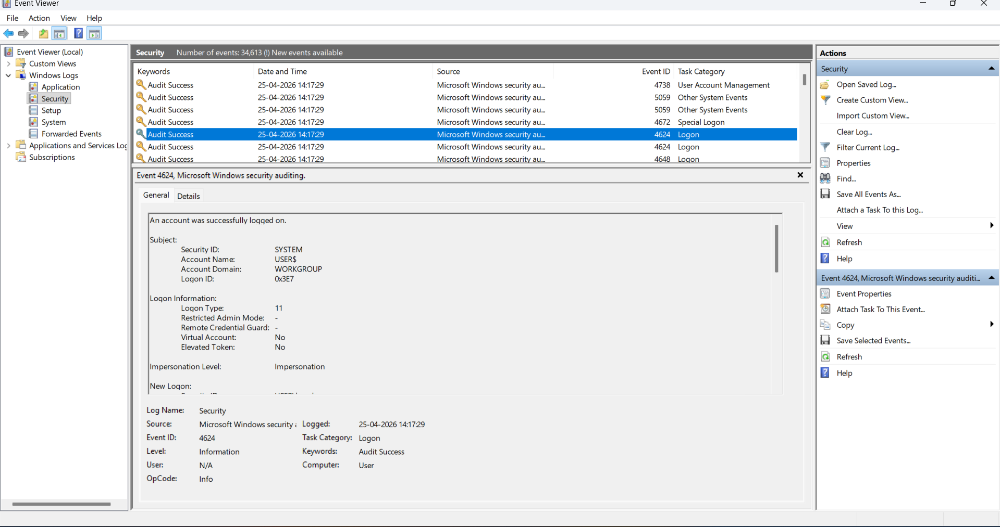
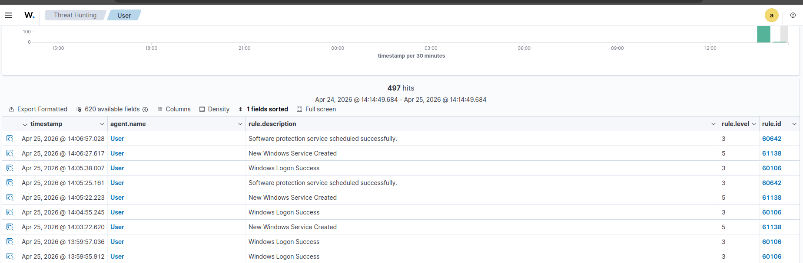
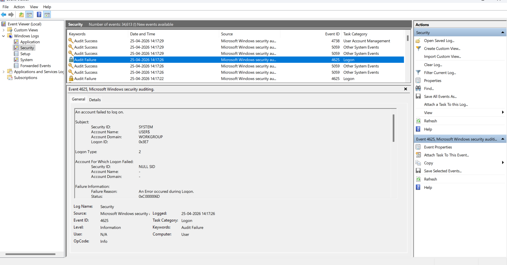
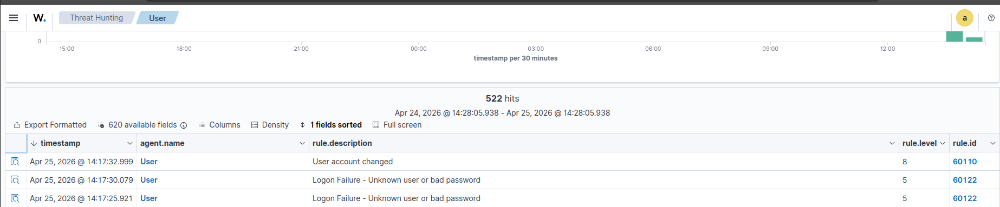
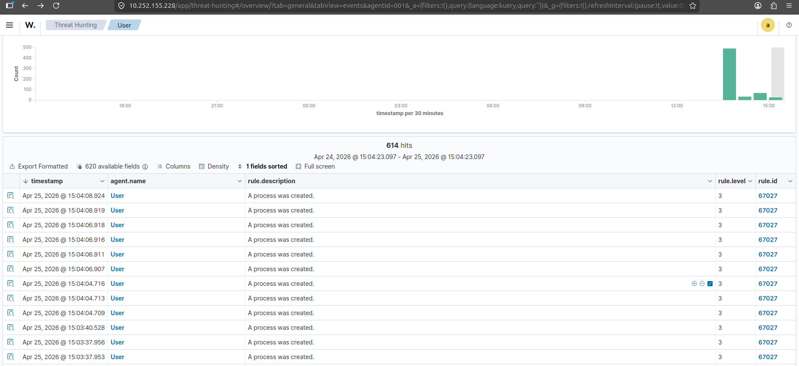

# Windows Event Logging and Telementary Integration
This lab demonstrates Windows Event Auditing and its integration with Wazuh SIEM. It features documented workflows for capturing security logs, including Event Viewer analysis and real-time visualization of process creation events on the Wazuh Dashboard.
## Lab Overview
This lab simulates real-world Windows security events to demonstrate the visibility SOC analysts gain by combining native Windows telemetry with Wazuh SIEM for centralized monitoring and incident response.
Events Covered:

-1.Event ID 4624 – Successful Logon
-2.Event ID 4625 – Failed Logon
-3.Event ID 4688 – Process Creation
The connection works Here’s how the same log looks in Event Viewer and then inside the Wazuh Dashboard

# Event ID 4624 – Successful Logon
This event is generated when a user successfully authenticates to a Windows system. SOC analysts use it to track legitimate access patterns, identify unusual login times, and detect suspicious logon sources.
Key Fields Reviewed:

- TimeCreated – Timestamp of logon
- User – User account that logged in
- Source – Machine or service generating the event
- Logon Type – Interactive, Remote

Screenshots:

SOC Relevance: Used to detect unauthorized access and potential lateral movement within the network.

# Event ID 4625 – Failed Logon
This event is generated when a login attempt fails. Multiple occurrences may indicate brute-force attacks or misuse of credentials.

Key Fields Reviewed:

- TimeCreated – Timestamp of failed logon
- User – Account that failed to log in
- Failure Reason – Why the logon failed
- Source – Machine or service generating the event
  
Screenshots:

SOC Relevance: Plays a critical role in identifying brute-force attacks and potential account enumeration attempts.

# Event ID 4688 – Process Creation

This event is generated when a new process is created. SOC analysts use it to monitor and detect suspicious or unauthorized process activity.

Key Fields Reviewed:

- New Process Name – The executable that was launched
- Parent Process – Process that spawned this process
- Command Line – Full command used (if enabled)
- User Context – User that executed the process
  
Screenshots:

SOC relevance: Used to detect malware execution, scripting abuse, and privilege escalation.

# Lab Notes / Observations
- Event Viewer logs provide detailed insights into user activity and system events.
- Wazuh SIEM centralizes log collection, enabling effective event correlation and real-time security alerting.
- SOC analysts use this data to detect suspicious activities such as multiple failed logins, unusual process creation, and unauthorized access attempts.

## Outcome
Improved understanding of Windows authentication and process execution logs used in SOC investigations.

